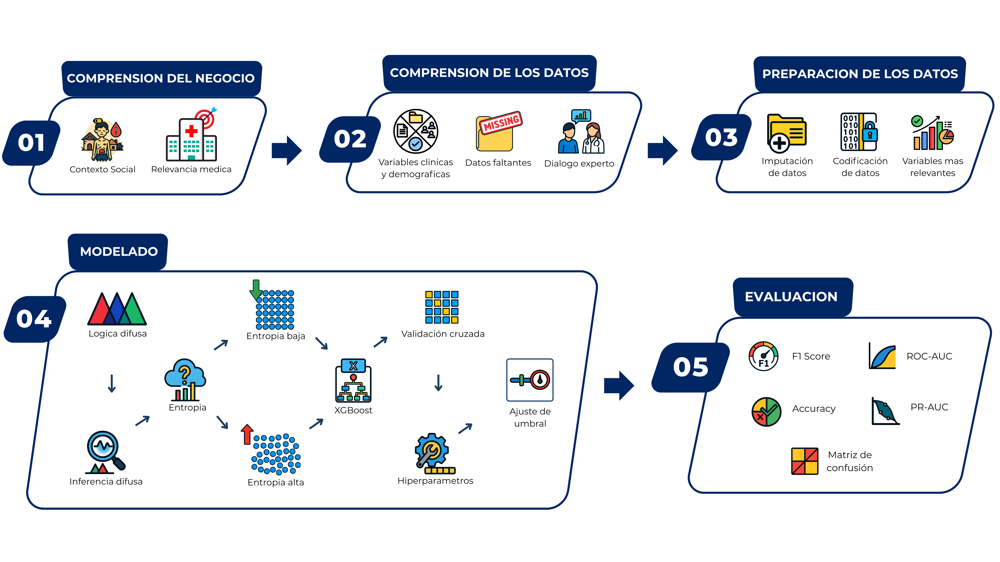
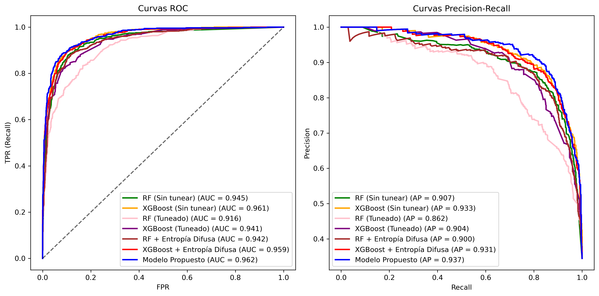

# 🔬 Clasificación de Anemia Infantil con Entropía Difusa y XGBoost

Este proyecto desarrolla un **modelo de clasificación híbrido** que combina **entropía difusa** con el algoritmo **XGBoost** para la predicción de anemia infantil en Perú.  
El modelo busca **identificar los factores que contribuyen a la prevalencia de anemia infantil**, mejorando la precisión respecto a métodos tradicionales de *machine learning* como Random Forest y árboles de decisión.

---

## 🎯 Objetivo del estudio
El objetivo principal fue **desarrollar un modelo de clasificación basado en entropía difusa para la identificación de factores asociados a la prevalencia de anemia infantil en niños peruanos**, logrando un mejor equilibrio entre sensibilidad (*recall*) y precisión (*precision*) que los modelos convencionales.

---

## 🌍 Contexto
La anemia infantil es un problema de salud pública en Perú, con alta prevalencia en zonas rurales y poblaciones vulnerables.  
Estudios previos en el país han utilizado algoritmos clásicos como **Random Forest**, **árboles de decisión**, **Naive Bayes** y **regresión logística**, pero sus resultados presentaron limitaciones:

- **Random Forest (ENDES 2022)**: exactitud del 70% y sensibilidad de 65.9% [Ramírez et al.].  
- **Árboles de decisión (Arequipa)**: precisión de 74.5% [Mayhua et al.].  
- **Modelos tradicionales (diversos)**: dificultades para superar niveles aceptables de desempeño y baja capacidad para manejar incertidumbre [Céspedes 2022].

Estos antecedentes muestran la necesidad de metodologías más robustas para manejar la **incertidumbre** y la **complejidad de factores clínicos y sociales** que influyen en la anemia.

---

## 🧩 Metodología


1. **Preprocesamiento de datos clínicos**  
   - Variables utilizadas: edad, sexo, peso, talla, hemoglobina, estado nutricional.  
   - Limpieza y estandarización.  

2. **Cálculo de entropía difusa**  
   - Implementación de un **transformador personalizado** en Python.  
   - Cálculo de funciones de pertenencia (*bajo, medio, alto*) y entropía difusa como medida de incertidumbre.  

3. **Entrenamiento del clasificador**  
   - Algoritmos base: Random Forest y XGBoost.  
   - Comparación con y sin integración de entropía difusa.  
   - Ajuste de hiperparámetros básicos y optimización de umbral de decisión.  

4. **Evaluación del modelo**  
   - Métricas: Accuracy, Recall, Precisión, F₁-score, ROC-AUC y PR-AUC.  
   - Validación cruzada y prueba en conjunto independiente.  

---

## ⚙️ Tecnologías utilizadas
- [scikit-learn](https://scikit-learn.org/) → Preprocesamiento, validación y métricas.  
- [xgboost](https://xgboost.readthedocs.io/) → Clasificador principal.  
- [scikit-fuzzy](https://pythonhosted.org/scikit-fuzzy/) → Cálculo de funciones de pertenencia y entropía difusa.  
- [pandas / numpy](https://pandas.pydata.org/) → Manejo de datos.  
- [matplotlib / seaborn](https://matplotlib.org/) → Visualización de resultados.
- [openpyxl](https://openpyxl.readthedocs.io/) → Manejo de datos en Excel.


---

## 📊 Resultados
El modelo final (XGBoost + Entropía Difusa + Ajuste de Umbral) alcanzó:

- **Accuracy:** 90.9%  
- **Recall (Sensibilidad):** 88.3%  
- **Precisión:** 85.8%  
- **F₁-score:** 0.870  
- **ROC-AUC:** 0.962  
- **PR-AUC:** 0.937  

---

## 📈 Visualizaciones
### Curvas de rendimiento


---

## 📌 Comparación con modelos previos
| Modelo | Accuracy | Recall | Precisión | F₁-score |
|--------|----------|---------|-----------|----------|
| Random Forest (Perú, ENDES 2022) | 70% | 65.9% | - | - |
| Árboles de decisión (Arequipa)   | 74.5% | - | - | - |
| **XGBoost + Entropía Difusa + Ajuste de Umbral (este estudio)** | **90.9%** | **88.3%** | **85.8%** | **0.870** |

🔎 **Discusión:**  
- El modelo propuesto supera en más de **15 puntos porcentuales en exactitud** a estudios previos realizados en Perú.  
- Además, logra un **balance más sólido entre sensibilidad y precisión**, fundamental en el tamizaje de anemia infantil.  
- La entropía difusa mejora la robustez de las predicciones al capturar la **incertidumbre** en los datos clínicos, algo que los métodos tradicionales no lograron manejar de manera efectiva.

---

## 🔎 Interpretabilidad clínica
- La entropía difusa permite representar la gradualidad de los estados de salud.  
- Mejora la interpretabilidad clínica al complementar las métricas con información sobre la **incertidumbre**.  
- Ofrece a los especialistas una herramienta más cercana a la realidad compleja de los pacientes.

---

## 🚀 Aplicabilidad práctica
- El modelo puede integrarse en **sistemas de salud pública** para campañas de detección temprana.  
- Escenarios posibles:  
  - **Tamizaje poblacional:** priorizar sensibilidad para identificar la mayor cantidad de casos posibles.  
  - **Diagnóstico clínico:** priorizar precisión para evitar falsos positivos.  
- Su arquitectura modular permite replicarlo en **otros problemas de salud multifactoriales** como desnutrición, diabetes o enfermedades cardiovasculares.

---

## ⚠️ Limitaciones y trabajo futuro
- El modelo se entrenó con **variables clínicas básicas** (edad, peso, talla, hemoglobina).  
- No se incluyeron **factores socioeconómicos, demográficos ni culturales**, por limitaciones de acceso a datos sensibles.  
- **Futuro:** integrar **bases de datos más amplias y multicéntricas** que incluyan determinantes sociales y nutricionales.  

✅ A diferencia de otros enfoques, esta limitación no debilita el modelo: al contrario, su **modularidad y escalabilidad** permiten adaptarlo fácilmente a nuevos contextos y variables.

---

## 📌 Conclusión
Este proyecto demuestra que la combinación de **entropía difusa** y **XGBoost** constituye un aporte metodológico sólido para la clasificación de anemia infantil.  
El modelo propuesto alcanzó **p < 0.05 en AUC-ROC**, con métricas superiores al 90% en exactitud y un **F₁-score de 0.870**, confirmando su eficacia en comparación con trabajos previos en Perú.  

👉 La hipótesis central queda validada: **la entropía difusa mejora la precisión y robustez de los modelos de clasificación, permitiendo gestionar la incertidumbre en los datos de salud pública**.  

Además, el enfoque es **replicable y escalable** a otros problemas complejos de salud, abriendo el camino hacia políticas públicas basadas en evidencia y en modelos de analítica avanzada.

---

## 🗂️ Estructura del repositorio

---

## 🚀 Cómo ejecutar
1. Clonar el repositorio:
   ```bash
   git clone https://github.com/jhonvilcarana/Anemia_Fuzzy_Entropy.git
   cd anemia-fuzzyentropy
